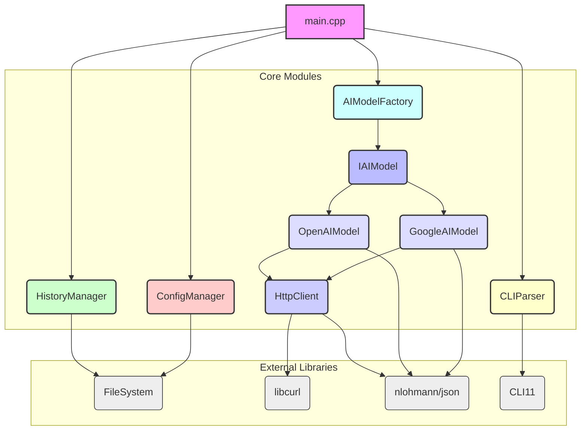

# HAICL (Hitmux AI in Command Line) 项目架构设计与技术选型

## 1. 架构设计总览

HAICL项目将采用模块化设计，以确保代码的清晰性、可维护性和可扩展性。核心模块及其职责如下：

**模块职责：**

*   **`main.cpp`**: 主程序入口，负责初始化所有模块，解析命令行参数，根据用户输入协调不同模块的工作流程（命令行模式或交互模式）。
*   **`ConfigManager`**: 配置管理模块，负责从环境变量和配置文件（如`config.json`）中读取API密钥、URL、默认模型、代理设置等。提供统一的接口供其他模块访问配置信息。
*   **`CLIParser`**: 命令行解析模块，使用`CLI11`库解析命令行参数，支持快速提问模式和进入交互模式的选项。
*   **`HistoryManager`**: 历史记录管理模块，负责聊天记录的保存、加载、列出和修改。聊天记录将以`.txt`格式存储，每条消息包含时间戳、角色（用户/AI）和内容。
*   **`AIModelFactory`**: AI模型工厂，根据配置或命令行参数动态创建`IAIModel`的具体实现（如`OpenAIModel`或`GoogleAIModel`）。
*   **`IAIModel`**: AI模型接口，定义了所有AI模型都必须实现的通用接口，例如`sendMessage`方法，用于发送消息并接收AI的回复。这将确保未来扩展其他AI模型时的兼容性。
*   **`OpenAIModel`**: `IAIModel`接口的具体实现，负责与OpenAI兼容的API进行通信，处理请求和响应的JSON格式。
*   **`GoogleAIModel`**: `IAIModel`接口的具体实现，负责与Google AI API进行通信，处理请求和响应的JSON格式。
*   **`HttpClient`**: HTTP客户端封装，负责处理底层的HTTP请求（GET/POST）。它将封装`libcurl`库，处理请求头、请求体、响应体以及错误处理。考虑支持异步请求以提高用户体验。
*   **`FileSystem`**: 文件系统操作封装，提供跨平台的文件操作接口，主要用于`HistoryManager`和`ConfigManager`进行文件读写。
*   **`TerminalBeautifier`**: 终端美化模块，负责输出带有颜色和格式的文本，提升用户体验。

## 2. 技术选型解释

*   **网络库 (`libcurl` vs `cpprestsdk`)**: 我选择`libcurl`。主要原因如下：
    *   **成熟稳定**: `libcurl`是一个久经考验、功能强大的C语言库，拥有广泛的用户基础和活跃的社区支持。它在各种操作系统上表现出色，包括Linux。
    *   **轻量级**: 相较于`cpprestsdk`，`libcurl`更加轻量级，依赖项更少，这有助于减小最终可执行文件的大小，并简化部署。
    *   **C++友好封装**: 尽管`libcurl`是C库，但有许多成熟的C++封装（例如`curlpp`或直接使用`libcurl`的C API进行封装），可以方便地在C++项目中使用。
    *   **跨平台**: `libcurl`在Linux环境下表现优异，且易于集成到CMake构建系统中。
    *   `cpprestsdk`虽然提供了更现代的C++异步编程模型，但其依赖项较多，且在某些Linux发行版上可能需要手动编译或处理复杂的依赖关系，这会增加项目的复杂性。

*   **JSON解析 (`nlohmann/json`)**: `nlohmann/json`是C++社区中最受欢迎的JSON库之一。其优点包括：
    *   **易用性**: 提供直观的API，支持C++11的初始化列表和范围for循环，使得JSON数据的序列化和反序列化非常简洁。
    *   **单头文件**: 作为一个单头文件库，集成非常简单，只需将其包含到项目中即可，无需编译。
    *   **功能完善**: 支持JSON的所有数据类型，提供强大的查询和修改功能。

*   **命令行解析 (`CLI11` vs `cxxopts`)**: 我选择`CLI11`。原因如下：
    *   **现代C++风格**: `CLI11`使用现代C++特性，提供更简洁、更富有表现力的API。
    *   **功能丰富**: 支持子命令、选项组、默认值、验证等高级功能，非常适合构建复杂的命令行接口。
    *   **易于集成**: 同样是单头文件库，集成方便。
    *   `cxxopts`也是一个不错的选择，但`CLI11`在功能和API设计上更胜一筹。

*   **文件系统 (`C++17 std::filesystem`)**: `std::filesystem`是C++17标准库的一部分，提供了跨平台的文件系统操作功能。其优点包括：
    *   **标准**: 作为标准库，无需额外依赖，保证了代码的可移植性。
    *   **功能全面**: 支持路径操作、文件/目录创建、删除、遍历等常见文件系统操作。
    *   **类型安全**: 相较于C风格的文件操作，`std::filesystem`提供了更类型安全和面向对象的方式。

*   **Debian 12环境下的C++编译和运行的考虑**: 
    *   **编译器**: Debian 12通常预装了GCC的最新稳定版本，这将支持C++17及更高标准，满足`std::filesystem`的要求。
    *   **库依赖**: `libcurl`、`nlohmann/json`、`CLI11`等库在Debian的APT仓库中通常都有预编译的包，可以直接通过`apt install`安装，简化了依赖管理。
    *   **CMake**: CMake在Debian 12中也是标准工具，可以方便地用于构建项目。
    *   **调试**: GDB是Linux下标准的调试工具，可以配合VS Code等IDE进行远程调试。
    *   **部署**: 编译后的可执行文件可以直接在Debian 12或其他兼容的Linux发行版上运行，无需复杂的运行时环境配置。
